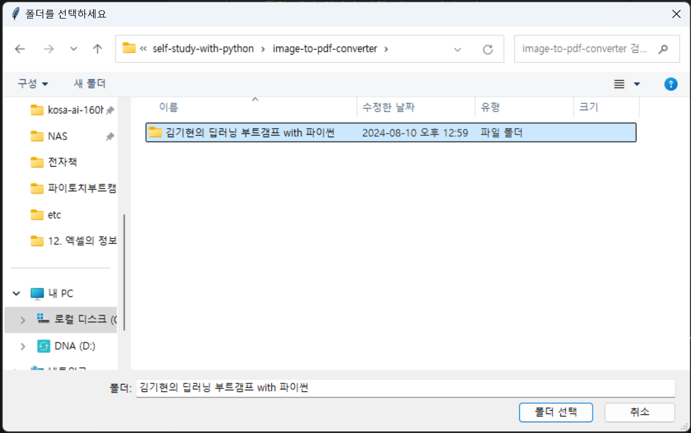
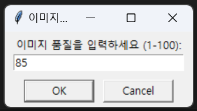

# Image to PDF Converter

[개요]
- 

여러 장의 이미지를 하나의 PDF 파일로 생성하는 코드입니다.

코드 실행 시 탐색기를 통해서 경로를 선택하고, 이미지 품질값을 통해 생성되는 PDF 품질을 조정함으로써 파일 사이즈를 줄일 수 있습니다.

- 경로 선택 : 탐색기 창에서 선택.
- PDF 품질 입력 : 1 ~ 100 입력, default 100
- PDF 페이지 정렬 : 이미지 파일명 오름차순
- PDF 저장 위치 : 선택한 폴더의 상위 디렉토리
- PDF 파일 명 : 선택한 폴더명 + 년월일 시분초.pdf

[설치 라이브러리]
-
명령어 : pip install pillow tqdm PyPDF2
- Pillow: 이미지 처리 라이브러리.
- tqdm: 프로그래스바 라이브러리.
- PyPDF2: 순수 파이썬 PDF 라이브러리.


[테스트 이미지]
- 
해당 폴더에 포함된 ```김기현의 딥러닝 부트캠프 with 파이썬``` 폴더의 이미지로 테스트할 수 있습니다.


[Images]
- 


